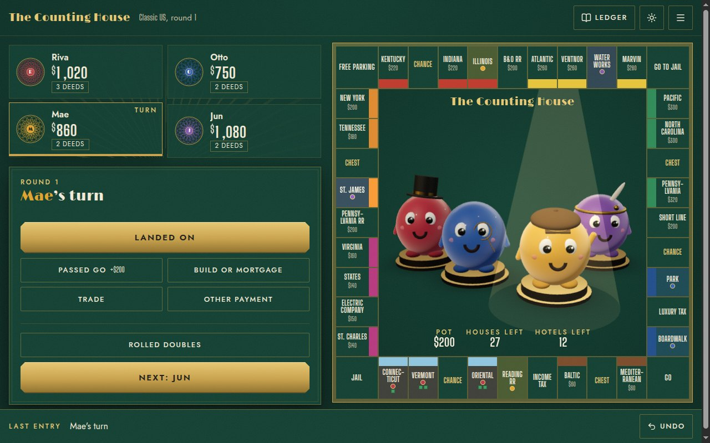
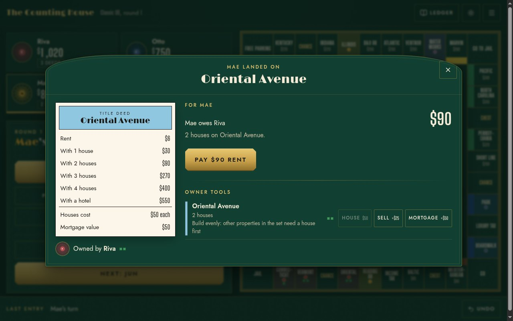
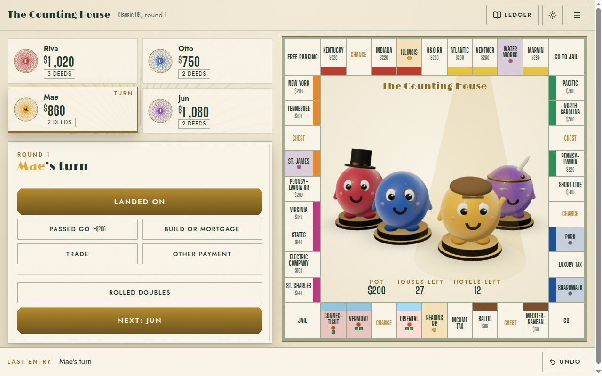

# The Counting House

**Play it now: [monopoly-manage.vercel.app](https://monopoly-manage.vercel.app)**

A banker for physical Monopoly nights. The board, dice, pieces and cards stay on the table. One laptop or tablet sits beside it, the admin records what happened, and the app moves the money, tracks deeds, houses, jail and turns, and keeps a ledger that can be undone.

No paper money to count, no rent tables to squint at, no banker mistakes.

## What it does

- **Setup:** 2 to 8 players, each with a colour, a banknote seal and a 3D creature wearing a 1930s accessory. The turn order is shuffled for you. Choose the Classic US or UK London board, or one you designed yourself.
- **Landed on:** pick the square and the app offers only what applies. Buy it or send it to auction, pay rent (worked out for you, with the reason shown), pay tax, draw a card, go to jail, or collect the Free Parking pot.
- **Cards:** pick the Chance or Community Chest card that was drawn and the app applies it: payments, birthday collections, repairs per house and hotel, advance to a square, nearest railroad or utility.
- **Build and mortgage:** even building, bank supply of houses and hotels, selling back at half price, mortgages with 10% interest.
- **Trades:** deeds, cash and jail cards between two players, with a summary before you shake on it.
- **Raise money and bankruptcy:** see what a player could raise, then hand everything to the creditor if it comes to that.
- **Ledger:** every action in plain words. Undo the last one, or rewind to any point.
- **Standings:** a podium and net worth using the official timed game rule.
- **House rules:** Free Parking jackpot, auctions, double salary on Go, and more, each switchable.
- **Sound effects:** arcade style chimes, all synthesized in the browser: a coin for money in, a jingle for buying, a power up for houses and hotels, a sad trombone for jail, a fanfare for the winner. Switch them off in the menu.
- **Board editor:** copy a classic board and change any name, price, rent, colour set or card to match your edition. Share boards as files.

The stage in the middle of the board shows whose turn it is (the creature in the spotlight), and gold coins fly from payer to payee: one coin for 10, plus one more each time the amount doubles.

## How it works

- `src/engine/` holds the whole game. Every action is a ledger entry made of small operations (transfer, own, build, mortgage, jail, turn), and the current state is replayed from the ledger. Undo is dropping the last entry, and replaying always gives the same numbers.
- `src/ui/` is the React interface, written in plain CSS with a Gilded Deco theme in felt night and banknote paper variants.
- `src/stage/` is the lazy loaded three.js scene with procedural creatures, so the rest of the app loads fast and still works without WebGL.
- `src/editor/` is the board editor, with field-by-field validation.

Not affiliated with or endorsed by Hasbro. Monopoly is a trademark of Hasbro. Bring your own board.
